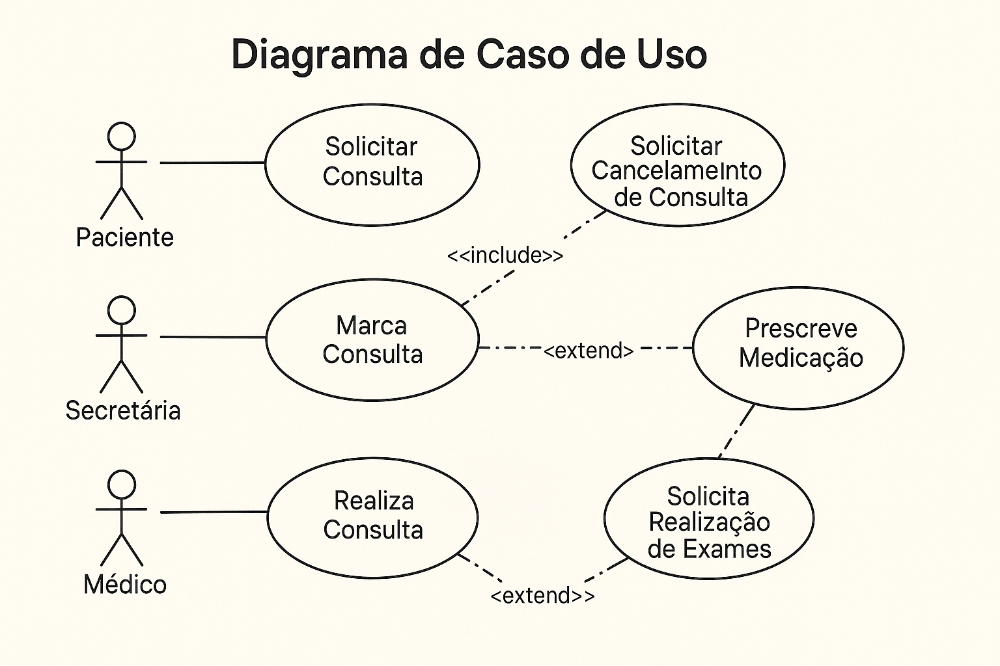
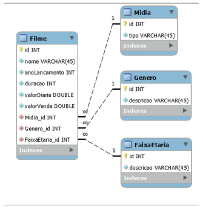
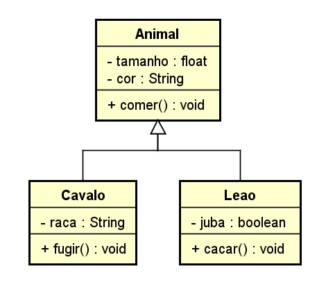

# Entrega 2: Documentação das principais funcionalidades e entidades da API

## Descrição Geral

A API \< nome a definir \> tem como objetivo ajudar a gerenciar despesas compartilhadas...

## Requisitos

| Identificação | Título | Descrição |
| --- | --- | --- |
| RF01 | ... | ... |

## Regras de negócio

| Identificação | Título | Descrição |
| --- | --- | --- |
| RN01 | ... | ... |

## Casos de uso

Imagem com o desenho de caso de uso.

(Exemplo de diagrama - ideal seria ser menor)

## Entidades

Como nossas entidades provavelmente serão provenientes do banco de dados, proponho nesse campo colocar uma imagem com o diagrama físico do banco de dados.

(Exemplo de diagrama)

## DTOs

Algo parecido com o que foi feito no tópico de entidades, mas usando um diagrama de classes.

(Exemplo de diagrama)