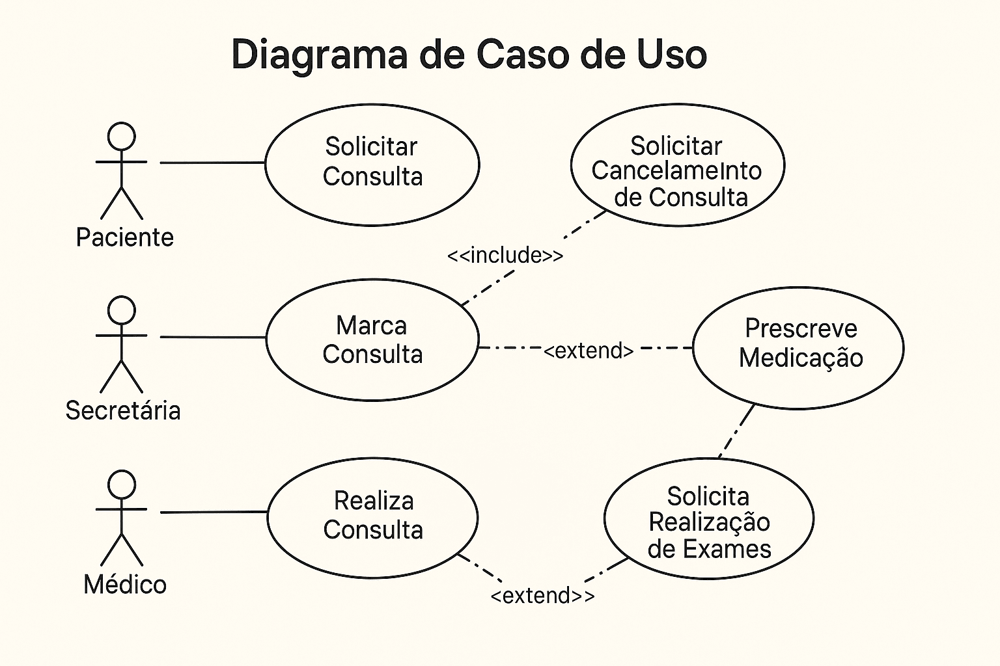
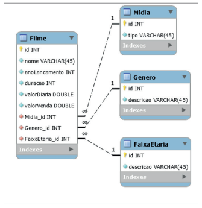
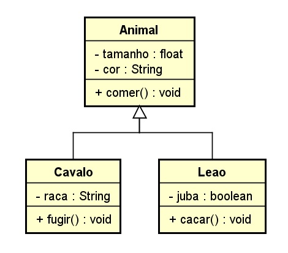

# Entrega 2: Documentação das principais funcionalidades e entidades da API

## Descrição

O protótipo de API - nomeada \< nome a definir \> - tem como objetivo ajudar a registrar/gerenciar despesas compartilhadas registrando e calculando eventuais dívidas...

## Requisitos Funcional

| Identificação | Título | Descrição |
| --- | --- | --- |
| RF01 | Cadastrar usuário | O sistema deve permitir o cadastro de novos usuários (atributos a definir) |
| RF02 | Atualizar dados de usuário | O sistema deve permitir que o usuário atualize seus dados pessoais |
| RF03 | Criar grupo | O sistema deve permitir que um usuário crie grupos de compartilhamento de despesas (atributos a definir) |
| RF04 | Excluir grupo | O sistema deve permitir ao usuário administrador do grupo excluir o grupo |
| RF05 | Editar dados do grupo | O sistema deve permitir o usuário administrador editar os dados do grupo |
| RF06 | Adicionar membros | O sistema deve permitir o administrador adicionar membros de um grupo |
| RF07 | Remover membro do grupo | O sistema deve permitir um usuário administrador remover um membro do grupo |
| RF08 | Tornar o membro de um grupo administrador | O sistema deve permitir o administrador de um grupo tornar um outro 
| RF09 | Sair do grupo | O sistema deve permitir o membro de um grupo sair dele |
| RF10 | Apagar grupo | O sistema deve permitir um usuário que saiu de um grupo apagá-lo |
| RF11 | Listar grupos | O sistema deve listar todos os grupos dos quais o usuário participa |
| RF12 | Listar membros do grupo | O sistema deve exibir os membros do grupo no qual o usuário está participando |
| RF13 | Registrar acordo | O sistema deve permitir o usuário membro de um grupo registrar um acordo entre os membros de um grupo (atributos a definir) |
| RF14 | Calcular saldos | O sistema deve realizar o cálculo de quanto cada membro participante de um grupo deve ou tem a receber |
| RF15 | Exibir saldo individual | O sistema deve exibir o saldo individual de cada membro dentro de um grupo |
| RF16 | Reiniciar saldos do grupo | O sistema deve permitir o administrador do grupo a reiniciar os saldos do grupo |
| RF17 | Exibir acordos do usuário |O sistema deve exibir os acordos ainda não concluídos que envolvam o usuário |
| RF18 | Validar dados de usuário | O sistema deve validar os dados referentes ao usuário |
| RF19 | Retornar mensagem de erro ao validar dado de usuário | O sistema deve retornar mensagem de erro caso seja encontrado um dado inválido na validação das informações do usuário | 
| RF20 | Validar dados de grupo | O sistema deve validar os dados referentes ao grupo |
| RF21 | Retornar mensagem de erro ao validar dado de grupo | O sistema deve retornar mensagem de erro caso seja encontrado um dado inválido na validação das informações do grupo |
| RF22 | Validar dados de despesa/acordo | O sistema deve validar os dados referentes ao acordo |
| RF23 | Retornar mensagem de erro ao validar dados de acordo | O sistema deve retornar mensagem de erro caso seja encontrado um dado inválido na validação das informações do acordo | 
| RF24 | Verificar se usuário existe | O sistema deve verificar se usuário existe |
| RF25 | Verificar se grupo existe | O sistema deve verificar se grupo existe |
| RF26 | Verificar se acordo existe | O sistema deve verificar se acordo existe |
| RF27 | Editar acordo | O sistema deve permitir que o usuário que cadastrou um acordo e o administrador do grupo possa editá-lo |
| RF28 | Excluir acordo | O sistema deve permitir que o usuário que cadastrou o acordo e o administrador do grupo possa excluir o acordo |
| RF29 | Retornar mensagem de erro quando não encontrar usuário | O sistema deve retornar uma mensagem de erro quando um usuário não for encontrado |
| RF30 | Retornar mensagem de erro quando não encontrar grupo | O sistema deve retornar uma mensagem de erro quando um grupo não for encontrado |
| RF31 | Retornar mensagem de erro quando não encontrar acordo | O sistema deve retornar uma mensagem de erro quando um acordo não for encontrado |
| RF32 | Verificar se membro de grupo existe | O sistema deve verificar se o membro e um grupo existe |
| RF33 | Retornar mensagem de erro quando não encontrar membro | O sistema deve retornar uma mensagem de erro quando um membro não for encontrado |

**Observações:**
- O administrador é um tipo de usuário que pode ser considerado um membro do grupo;
- Apagar um grupo é diferente de excluir. Se refere a tirar o grupo da lista de visualições do usuário;
- Um grupo excluído não é realmente excluído do banco de dados, mas inativo;
- A palavra **"acordo"** foi escolhido para representar um trato ou promessa de que uma dívida está ou estará paga entre os usuários;

## Requisito Não Funcional

| Identificação | Título | Descrição |
| --- | --- | --- |
| RNF01 | Disponibilização de diferentes moedas | Uma API externa deve ser usada para calcular o valor de diferentes moedas ao redor do mundo no momento atual em que um acordo é realizado |

## Regras de negócio

| Identificação | Título | Descrição |
| --- | --- | --- |
| RN01 | Capacidade de múltiplas moedas | Um acordo pode ser feito com mais de uma moeda principal |
| RN02 | Divisão de custos de uma acordo/despesa | Um acordo deve permitir diferentes tipos de divisões: divisão por igual, valor fixo, percentual e por partes |
| RN03 | Registro temporal e agregado dos saldos dos membros de um grupo | O sistema deve mostrar um relatório que contenha a quantidade dos saldos dos membros de um grupo e seus valores numa definida data ou intervalo de datas  |

## Casos de uso

Imagem com o desenho de caso de uso.

(Exemplo de diagrama - ideal seria ser menor)

## Entidades

Como nossas entidades provavelmente serão provenientes do banco de dados, proponho nesse campo colocar uma imagem com o diagrama físico do banco de dados.

(Exemplo de diagrama)

## DTOs

Algo parecido com o que foi feito no tópico de entidades, mas usando um diagrama de classes.

(Exemplo de diagrama)